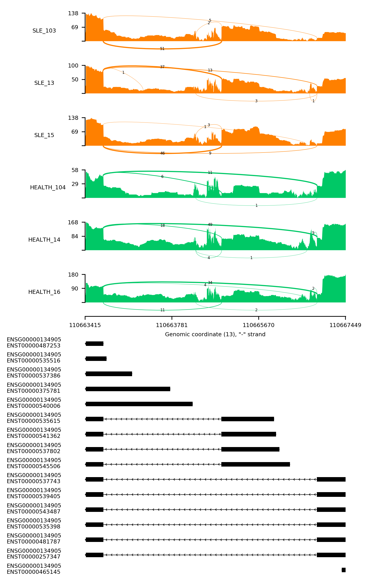
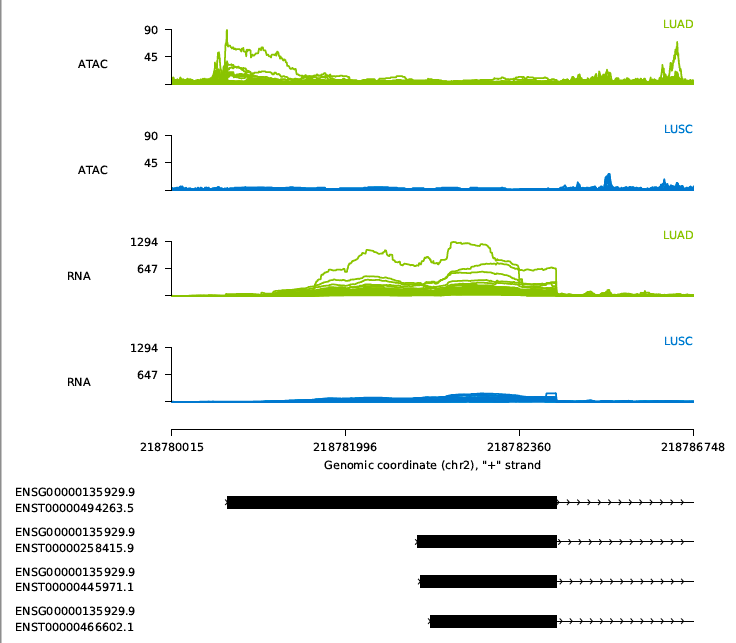

# pysashimi

### [2022/11/1] A newer implementation of sashimi with more features were finished in [sahsimi.py](https://github.com/ygidtu/sashimi.py), please try.

---

Pure python scripts to make sashimi plots

Why am I write this?

Cause I trying to integrate sashimi plots within Flask, rather than embed [JBrowse](https://github.com/GMOD/jbrowse) into it.

Thanks to [ggsashimi](https://github.com/guigolab/ggsashimi), I learned how to extract junctions and so on from BAM/SAM files

---


## Installation

Software requirements

- click = ">=7.0"
- cycler = ">=0.10.0"
- et-xmlfile = ">=1.0.1"
- filetype = ">=1.0.5"
- jdcal = ">=1.4.1"
- kiwisolver = ">=1.1.0"
- matplotlib = ">=3.0.1"
- numpy = ">=1.15.4"
- pyparsing = ">=2.4.2"
- pysam = ">=0.15.1"
- python-dateutil = ">=2.8.0"
- six = ">=1.12.0"
- pybind11 = "*"
- scipy = "*"
- rich = "*"
- pybigwig = "*"
- seaborn = "*"


1. install as command line tools

    ```bash
    git clone https://github.com/ygidtu/pysashimi.git
    cd pysashimi
    python setup.py install
    pysashimi --help
    ```
   
2. running from source

    ```bash
    git clone https://github.com/ygidtu/pysashimi.git
    cd pysashimi
    pip install -r requirements.txt
    ```
   
3. for `pipenv` users

    ```bash
    git clone https://github.com/ygidtu/pysashimi.git
    cd pysashimi
    pipenv install   # create virtualenv and install required packages
    pipenv shell   # switch to virtualenv
    python main.py --help
    ```

4. using docker image

    ```bash
    git clone https://github.com/ygidtu/pysashimi.git
    cd pysashimi
    docker build --rm -t ygidtu/pysashimi .
    docker run --rm ygditu/pysashimi --help
    ```

## Usage

There are three different mode in this suite of scripts

This suite of scripts will automatically check the index of BAM files and gtf files.

**If there are lack of any index file (.bai or .tbi), this script will try to create one. Therefore, the write permission may required.**

```bash
❯ python main.py --help
Usage: main.py [OPTIONS]

  This function is used to plot single sashimi plotting

Options:
  --version                       Show the version and exit.
  -e, --event TEXT                Event range eg: chr1:100-200:+  [required]
  -b, --bam PATH                  Path to input BAM file.

                                  Or a tab separated text file,  - first
                                  column is path to BAM file, - second
                                  column is BAM file alias(optional) Path
                                  to tab separated list fil 1. the column
                                  use to plot sashimi, identical with count
                                  table column names 2. optional, the alias
                                  of 1st column 3. additional columns
                                  [default: ; required]

  --sc-atac PATH                  The list of scATAC-seq fragments, same
                                  format with --bam  [default: ]

  --bigwigs PATH                  The list of bigWig files for signal display,
                                  same format with --bam  [default: ]

  -c, --count-table PATH          Path to input count table file. To make
                                  sashimi plot without bam  [default: ]

  -g, --gtf PATH                  Path to gtf file, both transcript and exon
                                  tags are necessary

  -o, --output PATH               Path to output graph file
  --config PATH                   Path to config file, contains graph settings
                                  of sashimi plot  [default:
                                  settings.ini]

  -t, --threshold INTEGER RANGE   Threshold to filter low abundance junctions
                                  [default: 0]

  -T, --threshold-of-reads INTEGER RANGE
                                  Threshold to filter low abundance reads for
                                  stacked plot  [default: 0]

  -d, --dpi INTEGER RANGE         The resolution of output file  [default:
                                  300]

  --indicator-lines TEXT          Where to plot additional indicator lines,
                                  comma separated int, sites occurred multiple
                                  times will highlight in re Or Path to
                                  file contains indicator lines, 1st column
                                  is the line site 2nd column is transcript id
                                  3rd column is the weights

  --share-y                       Whether different sashimi plots shared same
                                  y axis  [default: False]

  --no-gene                       Do not show gene id next to transcript id
                                  [default: False]

  --transcripts-to-show TEXT      Which transcript to show, transcript name or
                                  id in gtf file, eg: transcript1,transcript2
                                  [default: ]

  --color-factor TEXT             The index of specific column in --bam or
                                  path to color settings,  2 columns are
                                  required, first if key of bam or cell group,
                                  second column is color

  --log [0|2|10|zscore]           y axis log transformed, 0 -> not log
                                  transform; 2 -> log2; 10 -> log10  [default:
                                  0]

  --customized-junction TEXT      Path to junction table column name needs to
                                  be bam name or bam alias.

  -p, --process INTEGER RANGE     How many cpu to use  [default: 1]
  -f, --genome PATH               Path to genome fasta
  --sort-by-color                 Whether sort input bam order, for better
                                  looking  [default: False]

  --stack                         Whether to draw stacked reads  [default:
                                  False]

  --share-y-by INTEGER            Index of column with share y axis (1-based),
                                  Need --share-y. For example, first 3 bam
                                  files use same y axis, and the rest use
                                  another  [default: -1]

  --remove-empty-gene             Whether to plot empty transcript  [default:
                                  False]

  --distance-ratio FLOAT          Distance between transcript label and
                                  transcript line  [default: 0.3]

  --title TEXT                    Title
  --save-depth                    Whether to save reads depth to file, the
                                  last 3 columns are chrom, position and
                                  depth The same pos will repeated multiple
                                  times for joyplot in R  [default: False]

  --barcode PATH                  Path to barcode list file, At list  three
                                  columns were required 1st The name of bam
                                  file; 2nd the barcode 3rd The group label

  --barcode-tag TEXT              The default cell barcode tag label
                                  [default: CB]

  --reads [All|R1|R2]             Whether filter R1 or R2  [default: All]
  --show-side                     Whether to draw additional side plot
                                  [default: False]

  --side-strand [All|+|-]         Which strand kept for side plot, default use
                                  all  [default: All]

  --show-id                       Which show gene id or gene name  [default:
                                  False]

  -S, --strand-specific           Only show transcripts and reads of input
                                  region  [default: False]

  --draw-line                     Whether to draw line plot instead of normal
                                  sashimi  [default: False]

  --show-mean                     Show mean coverage by groups  [default:
                                  False]

  --focus TEXT                    The highlight regions: 100-200:300-400
  --stroke TEXT                   The stroke regions:
                                  start1-end1:start2-end2@color-label, draw a
                                  stroke line at bottom, default color is red

  --bigwig-clustering             The clustering the bigwig files  [default:
                                  False]

  --bigwig-clustering-method [single|complete|average|weighted|centroid|median|ward]
                                  The clustering method for the bigwig files
                                  [default: ward]

  --bigwig-distance-metric [braycurtis|canberra|chebyshev|cityblock|correlation|cosine|dice|euclidean|hamming|jaccard|jensenshannon|kulsinski|kulczynski1|mahalanobis|matching|minkowski|rogerstanimoto|russellrao|seuclidean|sokalmichener|sokalsneath|sqeuclidean|yule]
                                  The clustering method for the bigwig files
                                  [default: euclidean]

  --bigwig-scale                  The do scale on bigwigs files  [default:
                                  False]

  -h, --help                      Show this message and exit.
```

- -b/--bam: two different types of parameter were supported

    - path to specific BAM file
    - path to a list of BAM files (tab separated), and at least one column in this file
    - path to BAM files
    - The alias of BAM files, due to this list is tab separated, so space in this alias is also fine.
    - additional columns, may be used to assign colors and so on

  for example (do not add any table header in the actual list): 

  | first column        | second column | third column |
  | ------------------- | ------------- | ------------ |
  | /home/user/test.bam | Sample 1      | Red          |

- If bam list file is used, the order of bam file in this list is used. 
    If the `--sort-by-color` used, then reorder the bam list by colors, 
    to make sure same color bam file will be together.
- `-p/--process`: multiple process to read data from input files for faster processing
- `--share-y-by`: make different input files use different y axis. For example: 

- `--log`: zscore is used `scipy.stats.zscore` to convert density to zscore, just for test usage, please no use it in final plots.

- supported color map for heatmap
  ```bash
    'Blues', 'Greens', 'Oranges', 'Reds', 'Greys', 'Purples',
    'YlOrBr', 'YlOrRd', 'OrRd', 'PuRd', 'RdPu', 'BuPu',
    'GnBu', 'PuBu', 'YlGnBu', 'PuBuGn', 'BuGn', 'YlGn',
    'binary', 'gist_yarg', 'gist_gray', 'gray', 'bone',
    'viridis', 'plasma', 'inferno', 'magma', 'cividis',
    'pink', 'spring', 'summer', 'autumn', 'winter',
    'cool', 'Wistia', 'hot', 'afmhot', 'gist_heat',
    'copper', 'PiYG', 'PRGn', 'BrBG', 'PuOr', 'RdGy', 'RdBu', 'RdYlBu',
    'RdYlGn', 'Spectral', 'coolwarm', 'bwr', 'seismic'
  ```
 

## Sample

- sashmi plot share y axis

  

- Sahimi do not share y axis

  
  
- Line plot, used to viz ATAC

  
